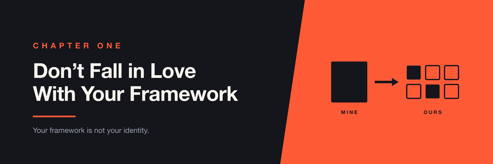

# Chapter 1 — Don't Fall in Love With Your Framework



> I've built things. I've been wrong. I've defended things I shouldn't have defended. I've changed my mind. Here's what I learned.

I had built the framework. I had made the architectural decisions, chosen the patterns, and spent time thinking about how the test suite should be structured. So when someone new joined the team and suggested doing things differently, my first reaction wasn't curiosity—it was resistance.

Looking back, that reaction taught me more about engineering than the framework itself.

## The Framework

At Automox, I built a Cypress end-to-end testing framework that ran in CI/CD. The goal was straightforward: give the team a reliable way to test the frontend and end-to-end flows automatically as part of the development process.

At the time, the Page Object Model was one of the most widely used patterns in test automation. It was familiar, well documented, and seemed like the right way to structure the framework. The architecture was roughly:

```text
Test → Page Object → Application
              │
              ├── Find elements
              ├── Click
              ├── Type
              └── Interact with application
```

The approach worked. Tests were running in CI, the framework was being used, and there wasn't an obvious problem that needed fixing. And that's where things got interesting.

## Someone Had a Different Idea

A new engineer joined the team. Because we were already using TypeScript, she suggested using a more modular approach instead of Page Objects. Rather than creating Page Object classes, instantiating them, and then calling their methods, we could expose functionality through modules and import what we needed directly.

Instead of:

```text
Create Page Object
       │
       ▼
Instantiate it
       │
       ▼
Call methods
```

we could do:

```text
Import module
       │
       ▼
Call functionality
```

The new approach was simpler. There was less ceremony, and fewer things to understand before writing a test. Technically, her proposal wasn't revolutionary—but it challenged something that was harder for me to recognize at the time: I was attached to the framework I had built.

## I Didn't Like It

I wish I could say I immediately recognized that the new approach was better. I didn't. My initial reaction was essentially:

> "Why change something that works?"

And that is a surprisingly dangerous question. Something working doesn't mean it is the best solution.

I had invested time into the framework. I had made the architectural decisions. I had built something that other engineers were using. At some point, the framework had become *my* framework, and that made it harder for me to evaluate it objectively.

The new engineer didn't try to force a complete rewrite. Instead, she gradually introduced the modular approach, and we migrated pieces over time. As I started using it, I began to understand what she saw: it was simpler, there was less ceremony, and engineers didn't need to understand as much of the framework before they could write tests.

Eventually, I accepted the approach. And the funny part is that I carried that lesson with me. At my next company, I found myself using the same approach I had originally resisted. The person who had argued against the change had eventually become the person recommending it. That was a pretty good lesson in humility.

---

## The Unexpected Lesson

The lesson wasn't that Page Objects are bad—they're not. The lesson was that **being right about a technology isn't the same as being right for the team.**

A pattern can be widely adopted, a framework can be well designed, and an architecture can work perfectly well—and it can still be the wrong choice for your organization. The moment you become emotionally attached to something because **you built it**, you stop evaluating it objectively. That's particularly dangerous when you're building internal developer tooling.

Your job isn't to protect your framework. Your job is to make engineers more effective. If someone comes along with a better idea, the best outcome isn't proving that your original design was right—it's ending up with something better.

> **Don't optimize for protecting the things you've built. Optimize for making the next version better.**

Or, even more simply:

> **Your framework is not your identity.**

---

## What I Learned Later

The original debate was about how we structured the test framework. But over time, I realized that framework decisions rarely exist in isolation. Later, I learned that the way TypeScript imports are structured can also have implications for build performance, which introduced another dimension to the discussion.

A pattern can make code easier for developers to understand while having consequences somewhere else in the toolchain. A change that improves test authoring might make builds slower. A framework that is simple for one team might become difficult to scale. A tool that works well locally might become expensive in CI. Developer experience isn't one-dimensional—there are always trade-offs.

I wouldn't turn this chapter into a deep dive into TypeScript build performance; that's another story. The important lesson is that **simplicity in one part of the system doesn't automatically mean simplicity for the entire system.** You have to understand the constraints around the system you're building.

---

## AI Changes the Equation

There's another reason this lesson feels even more relevant today. When I learned it, changing a testing framework meant real work: you had to understand the existing architecture, design the migration, rewrite tests, teach the team, and maintain the old and new approaches while the migration was happening.

AI changes some of that. Today, if you understand the fundamentals of the system, you can use AI to help rebuild or refactor large portions of a framework relatively quickly. You don't necessarily need to be religious about a particular implementation pattern—you can choose Page Objects, modules, or another abstraction entirely. What matters more is understanding **why the pieces exist and how they fit together.**

AI makes the cost of changing implementation patterns much lower, but it doesn't eliminate the need to understand architecture. In fact, I think it makes that understanding more important. If you don't understand the fundamentals, AI can produce a beautifully structured implementation of a bad idea. If you do, AI becomes a powerful tool for exploring different implementations.

> **AI makes frameworks easier to rebuild. It doesn't make fundamentals less important.**

---

## What This Means for DevEx

Developer experience work has a particular trap. You often build something that becomes infrastructure for other engineers. Eventually people depend on it, and that makes changing it uncomfortable.

But DevEx tooling should be evaluated by a different question.

Not:

> "How do we preserve this framework?"

But:

> **"Is this still the easiest way for engineers to accomplish the job?"**

That question gives you permission to replace your own work. Sometimes the best thing you can do for a framework is kill part of it, replace it, simplify it, or let someone else build a better version. The goal was never the framework—the goal was always the engineers using it.

---

## Questions to Ask Before Defending Your Design

Before rejecting someone's alternative, ask:

- Is my objection technical or emotional?
- Would I choose this architecture if I were starting today?
- Is this abstraction actually helping developers?
- Does the team understand it without me?
- Is there a simpler way to accomplish the same thing?
- Am I defending this design because it's good—or because I built it?
- What trade-offs does this choice create elsewhere in the system?
- What evidence would convince me to change my mind?

The last question may be the most important. You should always know what evidence could prove your design wrong.

---

## The Takeaway

Don't fall in love with your framework, and don't confuse familiarity with correctness. Understand the fundamentals and the constraints. Be willing to change your mind—and when someone comes along with a better idea, be willing to replace your own.

Because the best DevEx engineers aren't the ones who build the most impressive frameworks. They're the ones who make the work easier.
