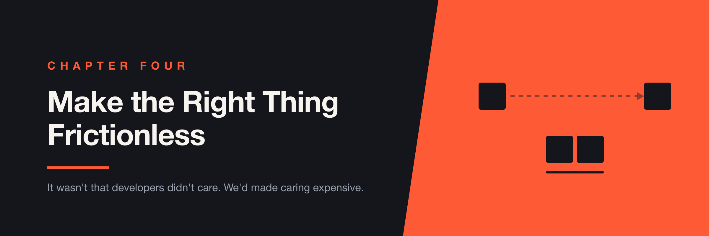

# Chapter 4 — Make the Right Thing Frictionless



> I spent years building test frameworks that impressed other SDETs. It took me longer than it should have to notice that impressing other SDETs was not the job.

One thing I've noticed throughout my career is that SDETs can be very good at building testing frameworks.

Sometimes too good.

We build abstractions. We create helper libraries. We separate concerns. We stand up dedicated repositories. We introduce frameworks flexible enough to support almost anything—and eventually we end up with something technically impressive that nobody else wants to touch.

I've done this myself.

One of the biggest lessons I learned at LTK was that **test automation shouldn't feel like a separate engineering discipline.** It should feel like part of building the product.

---

## The SDET Trap

There's a natural tendency for SDETs to create a separate home for automation. A dedicated repository, a dedicated framework, a dedicated set of tools, a dedicated process.

There are legitimate reasons for this. At Automox we had an integration testing repository separate from our services, and that made sense in our environment—we were working with microservices, and keeping integration tests outside any individual service gave us a place to test the interactions between them.

The problem wasn't that the repository was separate.

The problem was what happened next. The testing project became another system people had to understand. It was written in a different programming language than the services. It had its own patterns, its own dependencies, its own context.

For an SDET, that doesn't feel like much. For a developer, it's a completely different experience.

Imagine you're working on a service written in TypeScript. You finish your change and want to add or update an integration test. Instead of staying in the same project with the same language and the same patterns, you have to:

```text
Leave your service
       ↓
Open another repository
       ↓
Understand another codebase
       ↓
Understand another language
       ↓
Understand another testing framework
       ↓
Make your change
       ↓
Run a different workflow
```

That's a lot of context switching, and context switching has a cost.

Eventually developers stop contributing. Not because they don't care about quality—because the friction is too high.

---

## Developers Usually Don't Avoid Testing

When developers don't contribute to an automation project, the easy conclusion is:

> "Developers don't care about testing."

I don't think that's usually true. If contributing to tests requires learning a completely separate ecosystem, people naturally prioritize the work directly in front of them.

> **It wasn't that developers didn't care. We'd made caring expensive.**

That's not a culture problem. It's a **developer experience problem**, and the two need very different responses. You can't fix a friction problem with a values conversation.

---

## At LTK, I Tried Something Different

At LTK we moved our E2E testing framework into the frontend repository. The tests used the same language as the frontend, lived alongside the code they were testing, and followed the patterns developers already knew.

The goal wasn't the most sophisticated testing architecture possible. The goal was to make contributing to tests feel normal.

Instead of:

```text
Frontend Repository          Test Repository

TypeScript                   Different language
Frontend patterns            Different patterns
Frontend dependencies        Different dependencies
       │                             │
       └──────── Context switch ─────┘
```

we moved toward:

```text
             Frontend Repository
                    │
        ┌───────────┴───────────┐
        │                       │
   Application              E2E Tests
        │                       │
        └──── Same ecosystem ───┘
```

A developer didn't have to learn a new world just to add a test. They were already in the right place.

---

## The Best Framework Is Sometimes the One You Don't Notice

This changed how I think about testing frameworks.

A good framework isn't the one with the most abstractions. It's the one that makes the correct behavior easy. If a developer can open the repository, find an existing test, understand it, change it, and run it without asking an SDET for help, that's a bigger win than any amount of architectural elegance.

You don't need a framework that makes everything possible. You need one that makes the **common things easy**.

That's a very different design goal.

---

## Move Feedback Earlier

We also started running the E2E tests on every approved pull request.

Before that, testing tended to happen later. A developer finished their work, the change moved through the pipeline, and then QA found a problem—at which point the developer had to context-switch back into something they thought they were done with.

The longer that loop gets, the more expensive the feedback becomes.

```text
Developer
    │
    ▼
Write code
    │
    ▼
Pull Request
    │
    ▼
Automated tests
    │
    ├── Failure ──► Fix immediately
    │
    ▼
Approved
    │
    ▼
QA
```

The closer feedback is to the change that caused it, the cheaper it is to act on. The developer still has the context. The code is still fresh. The change is still small. Nobody has to rediscover what they were doing three days ago.

---

## Friction Compounds

A single extra step doesn't sound like much. But engineering systems rarely have one extra step. They have dozens.

Consider what "just add a test" can actually mean:

1. Open another repository.
2. Learn another language.
3. Understand another framework.
4. Configure another environment.
5. Find test data.
6. Run another command.
7. Figure out why the test failed.
8. Ask someone from QA for help.

Any one of those is reasonable. Together they change behavior. People avoid things that are difficult, postpone things that are inconvenient, and stop contributing to systems they don't understand.

What each of those steps really costs is context. Every time we ask an engineer to leave their normal workflow, we're asking them to reload it: where is this code, how does this project work, what language is it, how do I run it, what does this error mean?

Sometimes separating systems is the right architectural decision. But when you're deciding where an internal tool should live, it's worth asking:

> **"What context does this force the person using it to load?"**

That question rarely comes up in an architecture review. It should.

---

## Make the Right Thing the Easy Thing

There's a principle here that extends well beyond testing.

If you want developers to write tests, make writing tests easy. If you want developers to use a tool, make using it easy. If you want people to follow a process, make the process fit into the workflow they already have.

Don't rely entirely on training. Don't rely entirely on documentation. Don't rely on people remembering another process.

> **Make the desired behavior the path of least resistance.**

It's also cheaper than the alternatives. Documentation has to be maintained and read. Training has to be repeated for every new hire. A default that's simply easier keeps working without anyone tending it.

---

## But Don't Take "Frictionless" Too Literally

Not everything should be frictionless.

Sometimes friction is the point. A production deployment should have more safeguards than running a unit test. A destructive database operation should require more confirmation than creating a branch. A security-sensitive action shouldn't be one click away because someone wanted a nicer developer experience.

The goal isn't:

> "Remove all friction."

The goal is:

> **Remove unnecessary friction.**

The useful test is whether the friction is doing a job. A confirmation dialog that makes someone think before dropping a table is earning its place. A confirmation dialog on a read-only action is just noise—and worse, it trains people to click through the ones that matter.

---

## Test Automation Should Belong to the Product

I don't mean every test must live in the same repository. Plenty of situations call for separation, and integration tests across multiple microservices are a good example.

The lesson isn't:

> "Never create a separate testing repository."

The lesson is:

> **Don't create separation just because you're a testing team.**

If a test is tightly coupled to a frontend workflow, keeping it near the frontend probably makes sense. If it validates interactions across several services, a separate integration project might be exactly right.

The architecture should determine the boundary. Not organizational ownership.

That's easy to state and hard to hold. Team structure has a way of becoming system structure—Conway's law, pointed at your test suite—and a separate repository is the most natural thing in the world to create when you are a separate team. Ask whether the boundary you're drawing describes the system or the org chart.

---

## AI Changes the Equation

The single biggest friction in this chapter is "understand another codebase, in another language, using another framework." That happens to be exactly the cost that has fallen furthest.

A developer today can open an unfamiliar Python integration repository, ask a model to explain the fixtures and produce a test matching the existing patterns, and be productive in an afternoon rather than a week. The language barrier that made our separate repo feel like someone else's country is a smaller barrier than it was.

So does the argument in this chapter still hold?

Mostly, yes—because the chapter isn't really about knowledge. AI shortens the "learn it" step and leaves the rest untouched. It doesn't move the tests closer to the change. It doesn't make CI run them on the pull request. It doesn't shorten the feedback loop. And it doesn't do the thing that mattered most at LTK, which was making the tests feel like they belonged to the people writing the code. Ownership isn't a knowledge problem.

There's also a subtler risk worth naming. Friction is a signal. The separate repository in an unfamiliar language was *visibly* painful, and that pain is what eventually drove us to move the tests. Make the pain cheap enough to absorb and you remove the pressure that would have fixed the structure. The bad boundary survives, quietly, because everyone can now cope with it.

That's the same idea as Chapter 3's argument that constraints carry information. A cost you can no longer feel is a cost you'll stop designing around.

There is one genuinely new option, though. I've argued against relying on training and documentation, because both need someone to remember something at the right moment. Now there's a third choice: encode the conventions where the work happens. A `CLAUDE.md` at the repo root, an agent skill, a rules file for whatever editor your team uses—these carry the same content a wiki page would, except they're loaded at the moment of the task rather than read once during onboarding and then quietly going stale.

I'm using one to write this book. It holds the chapter structure, the banner specification, which directories must never be committed, and the conventions the earlier chapters established. I don't re-explain the house style every session; the environment supplies it. That's the same move as putting the E2E tests in the frontend repository—not new information, just information that now lives where the work happens.

This is the smallest version of what people have started calling context engineering: deciding deliberately what a tool knows before it starts work. A conventions file is *static* context—things that are true about your repository and change rarely. The larger version is dynamic, pulling in what's actually happening across GitHub, Linear, Slack, and your incident history, and that's a different problem for a later chapter. This one is just the part you can commit.

Two cautions.

The first: these files go stale, and a stale instruction file is worse than a stale wiki page.

Say yours tells the tool that tests live in `src/tests` and the team uses Cypress. Six months later the tests move to `e2e/` and the team switches to Playwright, and nobody updates the file. A person reading an out-of-date wiki page notices the folder doesn't exist and works out what changed. The tool doesn't. It follows the instructions, recreates the old folder, writes tests in the framework you abandoned, and hands you a pull request that looks entirely reasonable.

Wrong documentation gets ignored. Wrong instructions get followed.

The practical fix is to treat the file as part of the code it describes: if you move the tests, the line saying where the tests live moves in the same pull request. Otherwise you've built the thing Chapter 2 warns about—something running quietly on assumptions that stopped being true, with nothing set up to tell you.

The second caution is the trap from earlier in this section. A skill that carefully explains how to navigate a repository nobody should have to navigate isn't a fix. It's the friction signal being muffled one more time. Encode the conventions worth keeping; don't encode a workaround for structure you should be changing.

> **AI can teach you a codebase you shouldn't have to learn.**

---

## Questions to Ask Before You Build It Somewhere Else

When I design an internal engineering tool today, I start with one question:

> **"Can someone who didn't build this use it without me?"**

If the answer is no, I probably haven't finished the job.

For test automation specifically:

- Can a developer find the tests?
- Do they use a familiar language?
- Do they follow familiar patterns?
- Can developers contribute without an SDET?
- Do the tests run automatically?
- Does feedback arrive close to the change?
- Can someone understand why a test failed?
- Is there a clear path to fix it?

If several of those are no, the problem probably isn't that developers don't care about testing.

The problem is that we've made testing someone else's problem.

---

## Further Reading

- **Team Topologies** (Skelton & Pais) — on cognitive load as the real constraint on what a team can own. The clearest treatment I know of why "just learn the other repo" isn't free.
- **The Design of Everyday Things** (Don Norman) — affordances and the idea that if people use a thing wrong, the design is usually at fault. It applies to internal tooling more directly than most engineers expect.
- **Nudge** (Thaler & Sunstein) — choice architecture and defaults. "Make the desired behavior the path of least resistance" is this idea, and the book is a good corrective to relying on training and documentation.
- **Accelerate** (Forsgren, Humble & Kim) — the evidence linking fast feedback to delivery performance, useful if you need to argue for running tests earlier rather than asserting it.
- **"Shift Left Testing"** (Larry Smith, *Dr. Dobb's*, 2001) — where the term comes from, and worth reading because the original argument is narrower and more careful than the slogan it became.

The common thread: making the right behavior easy is a design problem, not a discipline problem.

---

## The Takeaway

Good test automation isn't just about coverage. It's about **feedback and ownership**.

If testing lives in a completely separate ecosystem, developers will reasonably see it as something QA owns. If it lives close to the product, uses familiar technology, and gives feedback while the change is still being written, contributing stops being a separate decision.

The goal isn't to turn developers into SDETs. The goal is to make quality part of normal engineering work.

> **Don't ask people to adopt another workflow when you can make the right workflow part of the one they already have.**
