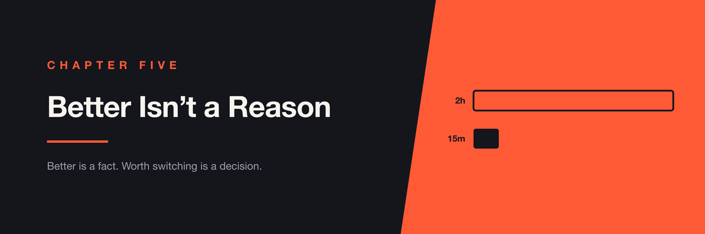

# Chapter 5 — Better Isn't a Reason



> In 2023 I published a comparison concluding that Playwright beat Cypress on every dimension I measured. My team was on Cypress. We stayed on Cypress. This chapter is about why that wasn't cowardice.

I like Cypress. I'd built with it, written about it, and taught people to use it. So when I sat down in October 2023 to compare it against Playwright, I said so up front:

> "Personally, my experience has mainly been with Cypress, so I naturally lean towards the framework I'm most familiar with."

Then I went through the categories one at a time, and Playwright won all of them.

---

## The Comparison

The gaps weren't subtle. Cypress couldn't run an individual test from the UI runner. It had no cross-tab testing. Tracing and visual regression meant reaching for third-party tools. Parallel execution required spinning up multiple containers, where Playwright could run several workers on a single instance. It was still promise-based rather than async/await. Playwright also spoke more languages and had first-class editor integration.

I wasn't trying to be provocative. I'd stated my bias in writing and then found against it, which is a reasonable definition of an honest evaluation.

At LTK, my team's end-to-end suite was Cypress.

We stayed on Cypress.

---

## Staying Was a Decision, Not a Drift

I want to be precise about this, because the two look identical from outside.

Drift is when a migration never gets scheduled, keeps not coming up, and eventually everyone stops mentioning it. What happened here was a decision: we looked at what a migration would cost in weeks, looked at what we'd get, and concluded it wasn't worth it.

That distinction matters because only one of them can be wrong in an interesting way. A drift is just neglect. A decision can be examined.

---

## A Comparison Table Measures the Tool

Here's the mistake buried in every framework comparison, including the one I wrote.

A comparison table measures two tools against each other in the abstract. It doesn't measure the thing you'd actually be doing, which is not "using Playwright" but "getting from here to Playwright." Those are completely different quantities.

Getting there means rewriting a suite. Rebuilding CI. Every engineer relearning how to write a test. Weeks of work that produces no product. And a period afterward where a suite that used to be trusted is new again, and every failure is ambiguous until people learn which ones are real.

> **A comparison table measures the tool. It doesn't measure the move.**

None of that appears in a feature matrix. It can't—it's specific to your suite, your team, and what else those weeks would have been spent on.

---

## The Comparison I Should Have Made

The real error in my article wasn't the conclusion. It was the framing.

```text
What I compared

   Cypress, as we happened to run it   vs   Playwright, at its best


What actually mattered

   Cypress, after we'd genuinely tried   vs   Playwright, plus the weeks
```

The top comparison is the one everybody makes, and it's rigged. You're measuring your current setup — with whatever accumulated sloppiness it has — against a tool you've only seen in its documentation, where nothing is flaky and every example is clean.

The bottom one is harder and more useful. It asks how much of the gap you could close without going anywhere.

For us, the answer turned out to be: most of it.

---

## Two Hours to Fifteen Minutes

Our suite took two hours to run.

That number was the strongest argument for switching. Playwright's parallelism was genuinely better, and two hours was slow enough to hurt — slow enough that people stopped waiting for results and started merging on hope.

So before deciding anything, we spent the effort on the suite we already had. None of the work was exotic:

```text
2 hours
   │
   ├── ran tests in parallel across containers
   ├── removed waits that weren't doing anything
   ├── moved data setup and cleanup to the API instead of the UI
   ├── improved locator strategies
   ├── reused sessions instead of logging in through the interface
   ├── navigated straight to the page under test
   ├── split by criticality: essential tests on merge, the rest nightly
   ├── turned off video recording nobody watched
   └── blocked third-party requests we weren't testing
   │
   ▼
15 minutes
```

Hundreds of tests, fifteen minutes, in parallel. An eight-fold improvement, and not one line of it required leaving Cypress.

That's the part the comparison table couldn't have told me. Most of our two hours was never Cypress's fault. It was logging in through the UI hundreds of times, waiting on timers that had been added to fix a flake nobody had diagnosed, and setting up data by clicking through forms. Those are things you can do badly in any framework. We had.

Playwright would have been faster still. Fifteen minutes versus, say, ten is a real difference and I won't pretend otherwise. But it's a very different question from two hours versus ten, and it's the only question we actually had to answer.

---

## What Staying Cost

It wasn't free, and I don't want to tell this as a story where the frugal choice had no price.

We worked around things. The gaps I'd listed in my own article were still there after I published it, and we lived with each one.

Cypress can't do cross-tab, so we tested each tab in isolation and asserted the handoff through the API instead. That works, and I'd defend it. But it isn't the same test. We were verifying that each half behaved correctly and that the data moved between them — not that a person could actually complete the flow across two tabs. A small permanent gap opened up between what we were testing and what we cared about, and we chose to live in it.

The other cost was the one I'd flagged myself: Cypress needed multiple containers to parallelize where Playwright would have used workers on a single instance. Our fifteen minutes was partly bought with CI infrastructure. We paid the difference in machines instead of engineering weeks — a trade I'd make again, but a trade, not a free lunch.

Workarounds also compound quietly. Each one is a small piece of local cleverness that a new engineer has to be told about, because they'd never guess it. That's a tax you pay slowly and never see on an invoice.

The honest summary is that we were fine. Not delighted. Fine — and shipping.

---

## When You Should Actually Switch

This isn't an argument for staying put. It's an argument against treating "better" as self-evidently sufficient. Some situations genuinely clear the bar:

**The gap is structural and you can't close it.** If you need cross-tab testing and your framework fundamentally can't do it, no amount of tuning helps. Our gaps had workarounds. That was the deciding fact.

**The tool is in trouble.** Unmaintained, losing contributors, or a vendor whose direction is pulling away from what you need. You're not just buying features, you're betting on the next three years.

**You're starting fresh.** This is the big one, and it's why my article wasn't wasted. On a new project with no suite to migrate, the switching cost is zero and the comparison table is the whole answer. I'd start something new on Playwright tomorrow. That was never in tension with staying — the two decisions share almost no inputs.

That last point is worth sitting with, because it's the thing people get wrong in both directions. "Which tool is better?" and "should we move?" feel like the same conversation and are not. Being clear about which one you're in resolves most framework arguments before they start.

---

## AI Changes the Equation

This whole decision hangs on one number: what a migration costs. That number has come down.

Converting tests from one framework to another is mostly mechanical translation, which is exactly what models are good at. What would have been weeks of rewriting is now closer to days. That should make me revisit the call I made in 2023, and it does — a little. But two things keep the answer from flipping.

**Rewriting the tests was never the expensive part.** The real cost of a migration is what comes after: rediscovering which tests are flaky under a new runner, rebuilding CI, and living through the stretch where a suite everyone trusted is suddenly new again and nobody knows which failures are real. AI shortens the translation and leaves all of that exactly where it was.

**The same tools make staying cheaper too.** This is the part that's easy to miss. If a model can port your suite to Playwright in two days, it can also strip your pointless waits and move your data setup to the API in two days. Migrating got faster, and so did fixing what you already have. Both options improved by roughly the same amount, which means the choice between them sits about where it did.

> **AI made both roads shorter. It didn't move the fork.**

---

## Questions to Ask Before You Migrate

- What specifically would we gain, and which of those things do we actually need?
- How much of that gap could we close without leaving?
- What's the move worth in weeks — and what doesn't get built during them?
- Is the limitation structural, or is it our configuration?
- Is the tool healthy: maintained, funded, going somewhere we want to go?
- Would we pick this tool for a new project? (And have we noticed that's a different question?)
- What would have to change for us to revisit this in a year?

The last one is what keeps a decision from turning into a drift. If you can't name what would make you reconsider, you haven't decided anything—you've just postponed it with extra steps.

---

## Further Reading

- **"Choose Boring Technology"** (Dan McKinley) — the innovation-token argument, and the best short piece on why the newer, better thing is often still the wrong call.
- **"StranglerFigApplication"** (Martin Fowler) — if you do migrate, this is the pattern that lets you do it a piece at a time instead of betting a quarter on a big-bang rewrite.
- **Information Rules** (Shapiro & Varian) — dated in its examples, still the clearest treatment of switching costs and lock-in as economics rather than vibes.
- **"Cypress vs Playwright"** (93days.me, October 2023) — my own comparison, if you want the list I graded myself against.
- **"Why E2E Tests Are Slow and How to Speed Them Up"** (93days.me) — the full version of the work that took us from two hours to fifteen minutes.

---

## The Takeaway

Playwright was better. It's still better. My team stayed on Cypress for another few years and shipped the whole time.

The question was never which tool would win a comparison. It was whether the distance between them was worth the weeks it would take to cross, and whether we'd honestly tried to close that distance from where we stood. We had, and it turned out most of the gap was ours, not Cypress's.

If you find yourself losing an argument about tools, check which argument you're having. "This one is better" is usually true and usually not the point.

> **Better is a fact. Worth switching is a decision. Don't let the first one make the second one for you.**
