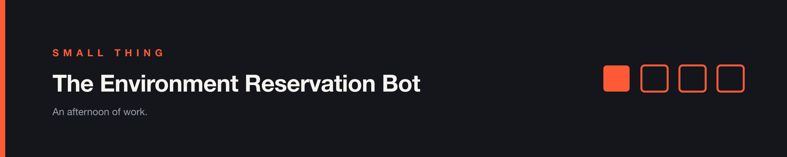

# Small Thing — The Environment Reservation Bot

*Some improvements don't need a chapter.*

---

**The problem.** We had a handful of shared test environments and no way to know who was on them. So people asked. *Is anyone using staging? Can I take env two? Is this one free?* A dozen times a day, in a channel where those messages sat between things that actually mattered.

Most of the time it was noise — a few seconds each, a small tax on attention, nothing you'd put on a roadmap.

Occasionally it was worse than noise. Someone would seed data into an environment another person was already running against, and a test run would fail for reasons that had nothing to do with the code. You'd then spend twenty minutes debugging what looked like a product bug and turned out to be a scheduling collision.

**What we built.** A Slack bot. Reserve an environment with a command, release it when you're done, ask who currently holds what. That's the entire feature set.

Nobody scoped it or put it on a roadmap. An engineer on the team got tired of the same question appearing every morning and wrote it. I found out because I reviewed the pull request.

**What changed.** The questions didn't decrease, they stopped — because asking a person had become the slow way to get an answer that a command returned instantly.

The collisions mostly stopped too. Not entirely, and the reason is worth being clear about: the bot tells you an environment is taken. It can't stop you taking it. It's a sign on a door, not a lock.

**Why it worked.** It didn't ask anyone to change how they worked.

The coordination was already happening in Slack. All the bot did was move it from humans to a command in the same window people were already typing in. Nobody had to learn a tool, open a tab, or remember a new process — which is the same argument as [Chapter 4](Chapter%204.md), arriving at a much smaller scale.

That's also why it was worth building at all. A bot that saves ten seconds and requires you to remember it exists will lose to just asking. This one won because using it was faster than the thing it replaced, in the same place, with no context to reload.

**When this doesn't apply.**

If you have three developers, talk to each other. A reservation system for a team small enough to know what everyone is doing is process for its own sake.

And if collisions are your *actual* problem rather than an occasional annoyance, a reservation bot is the wrong fix. Advisory locks work because people cooperate; they fail exactly when someone is in a hurry, which is when the collision hurts most. The real fix is environments that can't collide — ephemeral, per-branch, or with isolated data. That's a much bigger piece of work, and it's the right one if broken runs are costing you real time.

We didn't need it. Our problem was mostly noise, and the bot was an afternoon.

---

> **Match the size of the fix to the size of the problem. An afternoon of work solved ours. A platform would have been an insult to it.**
