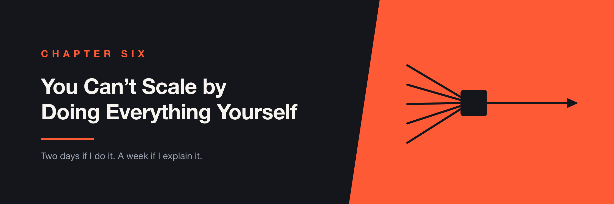

# Chapter 6 — You Can't Scale by Doing Everything Yourself



> I told leadership I could fix it in two days. That was true, and it was the wrong answer.

There's a sentence engineers say that sounds like efficiency and is usually something else:

> **"Two days if I do it. A week if I explain it."**

I've said it. I've believed it. And the uncomfortable part is that it's almost always accurate — which is exactly what makes it dangerous.

---

## The Question I Could Answer Too Quickly

At LTK, our end-to-end suite had gotten slow enough that leadership started asking why.

I knew why. I could have listed the reasons from memory, in order, with a rough estimate of what each one was costing us. The suite was mine in the sense that I'd spent more time in it than anyone.

But I wasn't the one assigned to fix it. Another engineer was, and he was stuck. Not because he wasn't capable — because the knowledge he needed was distributed across a codebase, a CI configuration, and my head, and only two of those were available to him.

So when the question came back around, I gave the honest answer:

*I can get this done quickly. Explaining it will take longer.*

Which was true. It was also a proposal to make myself more of a bottleneck than I already was, and I didn't hear it that way at the time.

---

## The Arithmetic Is Always Right

This is what makes the trap so effective. Run the numbers on any single instance and doing it yourself wins.

You already have the context. You've made the mistakes. You know which three of the twelve plausible causes are the real ones. Teaching all of that to someone else means slowing down to their pace, watching them try things you already know won't work, and answering questions whose answers are obvious to you and not to them.

Two days versus a week isn't a rationalization. It's a measurement.

The problem is that it's a measurement of the wrong thing. It's true this time, and it's true next time, and it's true the time after that — and each time you're comparing the cost of doing it against the cost of teaching it *once*, when what you should be comparing is the cost of teaching it once against the cost of doing it forever.

```text
Doing it myself
  2 days  →  2 days  →  2 days  →  2 days  →  ...
  and every one of them is mine

Teaching it once
  1 week  →  0  →  0  →  0  →  ...
  and none of them are
```

The first row is faster for about three weeks.

---

## What Doing It Myself Would Have Bought

A fixed test suite and a team in exactly the same position it was in before.

That's the whole return. The suite gets faster, everyone's happy, and the next time something in it breaks the question comes to me again — because nothing about the situation that made me the only answer has changed. I'd have been buying the same two days over and over and calling it efficiency.

There's a version of this that's about ego, and I've written a chapter about that one. This isn't quite it. I wasn't protecting the work. I genuinely thought I was being useful, and being useful felt good, and that's harder to notice than pride is.

> **If you're the fastest way to get something done, you're also the reason it can't be done without you.**

---

## Slow Down to Move Fast

The reframe, when it landed, was uncomfortable in a specific way: it meant the correct decision was to deliberately make this particular thing take longer.

Not "delegate it and check in." Actually slow down. Sit with someone while they work through a problem I could have finished in an afternoon, and let the afternoon become a week.

That's a hard thing to do while leadership is asking when the tests will be faster. The honest cost isn't just the extra days. It's that you spend them looking less effective than you would have looked doing it yourself, and you have to be willing to look that way.

---

## Documentation and Pairing

I did two things, and they do different jobs. Neither works alone.

**Documentation** scales and doesn't transfer judgment. Written well, it answers the same question for fifty people without you being in the room, and it keeps answering after you've left. What it can't do is teach someone which question to ask. A page explaining how our fixtures worked helped an engineer who already knew they needed a fixture. It did nothing for the engineer who didn't know that was the problem.

**Pairing** transfers judgment and doesn't scale. Sitting with someone while they debug a slow test is the only way I know to pass on the part that isn't writable — the order you check things in, what you dismiss immediately and why, the intuition that a two-second delay in a specific place means somebody added a wait to paper over a flake. That transfers to exactly one person at a time.

So the pattern that worked was pairing to create the understanding, then writing down whatever the pairing session revealed was missing. The pairing tells you what the documentation should have said. Doing it the other way round — writing the docs first and hoping people read them — mostly produces documentation that answers questions nobody had.

---

## What Changed

Engineers started writing their own tests.

That sounds modest written down, and it's the entire point. Not "engineers were able to write tests if they asked me first." Writing them, as a normal part of building a feature, without the question routing through me.

Which also meant tests started being written earlier, because the person writing them was the person writing the code, and they were both happening in the same week. That wasn't a shift-left initiative with a name and a rollout plan. It was a side effect of the people closest to the change being able to test it themselves.

The suite got faster too. It just wasn't the interesting part.

---

## When You Should Just Do It Yourself

This isn't an argument that teaching is always right.

**During an incident.** Nobody learns well at two in the morning with customers affected, and a production outage is not a training exercise. Fix it, then use it as material later.

**When it genuinely happens once.** If a piece of work has no second instance — a migration you'll never repeat, a vendor integration you're about to delete — the arithmetic that makes teaching worthwhile never runs. Teaching costs a week and saves nothing.

**When the person doesn't want it.** Not everyone wants to own the test infrastructure, and conscripting someone into expertise they didn't ask for produces a reluctant owner, which is worse than no owner.

**When you're honest about the deadline.** Sometimes the week isn't available. That's a legitimate reason to do it yourself once — as long as you notice you've now said that three quarters in a row.

The test is whether the work recurs. Recurring work is worth teaching. One-off work usually isn't, and pretending otherwise is its own kind of waste.

---

## AI Changes the Equation

The expensive half of "explain it to someone" was never the explaining. It was everything around it — the codebase they had to read first, the conventions nobody wrote down, the two days of orientation before a real question could even be asked.

That part has gotten dramatically cheaper. An engineer can now ask a model how the fixtures work, why a config is shaped the way it is, or what a piece of the CI pipeline does, and get a decent answer without spending your afternoon. The gap between two days and a week narrows, which means more work clears the bar for being worth teaching.

It's also something you can build, rather than something people do ad hoc. Point an agent at the repository, the CI configuration, the runbooks and the incident history, and onboarding stops being a document you hope somebody reads. It becomes something a new engineer can interrogate in their own words, at the moment they're stuck. *Why does this suite always fail on the first run?* gets an answer shaped to that question, instead of a wiki page that answers a slightly different one.

That's a genuine force multiplier, and it's the one I'd have wanted most. The week I owed that engineer was mostly orientation — and orientation is exactly the part that no longer needs a person in the room.

The catch is that it can only surface what's written down or inferable from the code. Where a convention lives only in somebody's head, a model won't say "I don't know." It will infer something and state it with the same confidence as everything else. That makes writing things down more valuable, not less — you're no longer only writing for the next engineer, you're writing for the thing that answers their questions at midnight.

But it narrows the *cheap* half. What a model can hand over is knowledge, and the thing that made me the bottleneck wasn't knowledge — it was judgment. Knowing which three of twelve plausible causes are worth checking first is a pattern built from having been wrong about the other nine. That's still transferred by sitting next to someone.

There's a failure mode worth watching for, too. If people can get plausible answers instantly, the pairing conversations stop happening, and a team can end up producing perfectly reasonable tests while nobody develops a sense of which tests are worth having. You get output without judgment, which looks fine right up until something requires a decision.

> **AI makes it cheaper to explain how something works. It doesn't make it cheaper to teach someone when to care.**

---

## Questions to Ask Yourself

- What can only I do right now?
- If I were unavailable for two weeks, which decisions would wait for me?
- Which of the things I keep doing recur, and which genuinely happen once?
- When I say it's faster to do it myself, am I comparing against teaching it once — or against doing it forever?
- Who on the team is stuck for reasons that live in my head?
- What did I explain out loud this month that should have been written down?
- Am I willing to look slower for a quarter?

That last one decides the rest. Most people know they should be teaching. What stops them is that the quarter where they teach looks worse than the quarter where they deliver, and nobody wants to volunteer for that.

---

## Further Reading

- **The Goal** (Eliyahu Goldratt) — the theory of constraints, and the uncomfortable observation that any improvement made anywhere other than the bottleneck is an illusion. Worth reading with the question of whether you *are* the bottleneck.
- **The Manager's Path** (Camille Fournier) — the clearest treatment of the transition from being the person who solves problems to the person who makes solving possible, including how bad it feels.
- **An Elegant Puzzle** (Will Larson) — on how work concentrates in particular people and what to actually do about it, rather than just noticing.
- **Apprenticeship Patterns** (Dave Hoover & Adewale Oshineye) — on how craft knowledge really moves between people, which is mostly not through documents.
- **Diátaxis** (diataxis.fr) — a framework separating tutorials, how-to guides, reference and explanation. Most internal documentation fails because it's trying to be all four at once.

---

## The Takeaway

The sentence is true. Two days if you do it, a week if you explain it. Every time you check, it will be true.

It's just answering a question about this week, and you are not running a team for a week.

The suite I could have fixed in two days was never the point. The point was whether the next slow suite, and the one after that, would also come to me — and the only way to change that answer was to spend a week I didn't want to spend.

> **Being the fastest person to solve a problem is a good way to make sure you're always the one solving it.**
