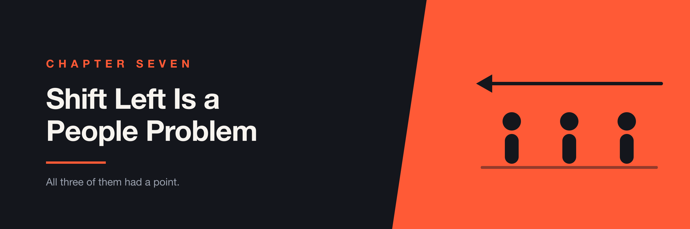

# Chapter 7 — Shift Left Is a People Problem

> Three groups told me this wouldn't work. All three of them had a point, and I still think we were right to do it.

The technical argument for shifting testing earlier is not hard to make. Feedback close to the change is cheaper than feedback far from it. Almost nobody disputes this.

Then you try to do it, and you discover the argument was never the obstacle.

At LTK we moved end-to-end testing toward the developers writing the features. Not as a slogan — as an actual change in who wrote what. And the resistance arrived from three directions, in the order you'd expect, from people who each had a legitimate reason to object.

---

## What We Were Actually Changing

Briefly, because the practice matters less here than the reaction to it.

Developers would write end-to-end tests for their own features. The regression suite would trigger automatically on pull request approval rather than being something QA kicked off later. Third-party dependencies would be mocked so tests failed for product reasons rather than network ones. We'd agree an execution time budget, so "the tests are slow" became a number somebody owned rather than a complaint.

That's the shape. It's not complicated, and none of it is the interesting part.

---

## "E2E Tests Are Flaky, and This Isn't Our Job"

This was the first objection and the most immediately fair.

End-to-end tests *are* flaky, more than any other kind. Ours were, at times. So the developer hearing "you'll be writing these now" is being handed a category of work with a reputation for burning afternoons on failures that turn out to be nothing. That's not obstruction. That's pattern recognition.

The mistake I could have made — the one I've seen made — is arguing the point. Telling people their flakiness experience isn't representative, that they'll see, that it's fine once you get used to it. Nobody has ever been persuaded by this.

The only answer that works is to make the objection untrue before you ask again. Mocking third-party calls, so a failure means something about the product. Explicit waits removed, so timing isn't a coin flip. A time budget, so the suite doesn't grow into something people avoid running. The complaint was about reliability, and reliability is a thing you can go and fix.

The "not our job" half is different, and it isn't really a technical claim. It's a claim about what the role is, which is worth taking seriously rather than dismissing. If your organization has spent years telling developers that quality is somebody else's department, they learned that from you.

---

## "This Will Slow Us Down"

Managers said this, and they were also right.

It does slow you down. Writing a test takes time that wasn't in the estimate, and the first tests a team writes are worse and slower to write than the ones they'll write in six months. There's a real dip, and pretending otherwise makes you sound either naive or dishonest.

What made this conversation possible was having something other than conviction to offer. A team lead being asked to absorb a velocity hit deserves better than a promise that it pays off eventually.

So it was worth pointing at the actual research — teams that deploy more often are not doing it by testing less — and, more usefully, at our own numbers. Where was time already going? What was the cost of a defect found by QA a week after the code was written, in context-switching alone? Some of that is measurable, and measurable beats sincere.

But I want to be careful here, because there's a dishonest version of this argument. The claim isn't that shifting left is free. It's that you're already paying the cost somewhere less visible — in rework, in context switching, in bugs found late by people who then have to go find the person who wrote it. Moving the cost earlier makes it show up on someone's sprint, which is precisely why it feels new.

---

## "So What Happens to Us?"

The QA engineers asked the sharpest question, and it was the one I had the least comfortable answer to.

If developers write the tests, what is the QA engineer for?

You can hear this as insecurity. It isn't. It's a correct reading of the situation, arrived at faster than most people in the room managed. When someone's role is defined by executing a thing and you announce that the thing will now be executed by others, they are not being paranoid.

The honest answer is that the job changes, and "changes" is doing real work in that sentence. It moves from running tests to building the things that let other people run them — the framework, the CI, the data setup, the tooling that makes a developer's test reliable enough to trust. That's a different job. It's a more technical one, and some people want it. Others took the role because they liked the part that was going away.

I don't think there's a way to say that kindly and also honestly. What I'd say now, more clearly than I said then: the change is real, it's worth naming out loud rather than reassuring people past it, and the people affected deserve to hear it from you directly rather than work it out from a slide.

What made it something other than a threat was that there was somewhere to go — a team responsible for test frameworks and infrastructure, with real work in it. Announcing a shift-left initiative without that is asking a group of people to argue for their own redundancy, and they will decline, correctly.

---

## Locomotives

You do not convert an organization. You convert a team, and then you let other teams watch.

Every group has one or two engineers who are already curious about this and will try it without being told to. They're worth more than any presentation, because their team believes them and doesn't believe you. Give them the support, let them go first, and let the result be visible.

What makes this work isn't enthusiasm, it's proximity. A team hearing "shift left improves delivery performance" from a slide is hearing an abstraction. The same team hearing "the tests caught it before it merged, I didn't have to come back to it on Thursday" from someone sitting near them is hearing something concrete about their own week.

The corollary is worth stating: don't start with the team that's most sceptical, and don't start with the team under the most delivery pressure. Both are reasonable-sounding choices and both fail. Start where it will work.

---

## What Actually Made It Stick

A few things, none of which are inspiring.

**Automated enforcement, not reminders.** Pull request size limits, linters, templates. A convention that depends on people remembering is a convention that decays. Chapter 4's argument, applied to process.

**A number for slowness.** An execution time budget for the suite meant "the tests are slow" became something with an owner and a threshold rather than an ambient complaint.

**Getting into architecture reviews.** By the time a design is done, the testability of the thing has already been decided. Being in the room earlier changed more than any amount of test writing afterwards.

**Postmortems on the automation itself.** When a test failed for a bad reason, treating that as something to investigate rather than to rerun. Suites decay because nobody owns the decay.

---

## Where This Goes Wrong

**When it's a mandate.** Announced from above, tracked as compliance, it produces tests written to satisfy a checker. You'll get coverage and learn nothing from it.

**When the framework isn't ready.** Asking developers to contribute to something painful is asking them to confirm their existing opinion of it. Fix the thing first — that's Chapter 4 — then ask.

**When there's no QA future to point at.** Covered above, and it's the one that does lasting damage. People remember how that conversation went for years.

**When nobody absorbs the dip.** Somebody has to be willing to see slower delivery for a quarter and not panic. If that person doesn't exist above you, the initiative dies the first time a release slips, and everyone learns that the change wasn't real.

---

## AI Changes the Equation

Two of the three objections have moved.

*"E2E tests are flaky"* is partly a maintenance problem, and maintenance is where models are genuinely useful — updating selectors, triaging whether a failure is product or environment, spotting the timing assumption that made a test unreliable. The suite is less of an ongoing tax than it was.

*"This will slow us down"* has moved further. Writing the first test for a feature was the expensive part, and it's now much cheaper. The dip is shallower than it was in the year I'm describing, which weakens the strongest practical objection to doing any of this.

The third objection has not moved. If anything it's sharper: if a developer can generate a test in minutes, the question of what a QA engineer is for gets asked more insistently and by more people. The answer is the same as it was, and now matters more — test design, deciding what's worth verifying, knowing which generated test is confidently checking the wrong thing. Chapter 18 is about exactly that failure. Someone has to be able to look at a passing suite and know it isn't evidence.

> **AI removes the excuses for shifting left. It doesn't remove the reason people resist it.**

---

## Questions to Ask Before You Start

- Which teams already want this? Start there.
- Is the framework good enough that contributing to it is a pleasant experience?
- What happens to the people whose role this changes — and can you say it out loud?
- Who is absorbing the velocity dip, and do they know they've agreed to?
- What's the current cost of finding defects late, in numbers you can show?
- Is quality currently a department, and if so, who taught the organization that?
- What will you enforce automatically rather than ask people to remember?

The third one is the test of whether you're ready. If you can't answer it in plain language to the people it affects, you're not ready to announce anything.

---

## Further Reading

- **Diffusion of Innovations** (Everett Rogers) — where the early-adopter idea comes from, and why the sequence you convert people in matters more than the argument you use.
- **Switch** (Chip & Dan Heath) — on change that has to happen through people who didn't ask for it. Practical rather than inspirational, which is rare in this category.
- **Modern Testing Principles** (Alan Page & Brent Jensen) — the clearest articulation of QA moving from gatekeeper to enabler, written by people who did it rather than proposed it.
- **Continuous Delivery** (Jez Humble & Dave Farley) — the technical foundation the whole argument rests on, including why trunk-based development and late testing don't coexist.
- **"Changing Quality Culture From Startup to Enterprise"** (93days.me) — my own write-up of this, with the practices in more detail than this chapter goes into.

---

## The Takeaway

The case for testing earlier is easy to make and almost impossible to argue against, which is why it's tempting to think the hard part is convincing people. It isn't. Everyone agrees in the abstract.

The hard part is that three different groups have specific, correct reasons not to want it — the tests really are flaky, it really will slow you down, and the role really does change. Every one of those is a real cost landing on a real person, and none of them are addressed by explaining the benefits again.

You deal with them by fixing the flakiness, being honest about the dip, and telling people what happens to their job before they have to ask.

> **The argument for shifting left is easy. The bill is what people are actually objecting to.**
