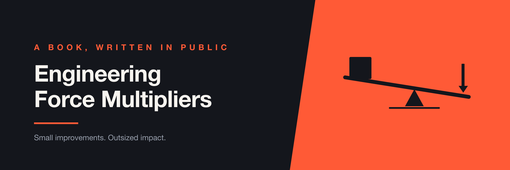

# Engineering Force Multipliers

> **Small improvements that make engineering teams dramatically more effective.**

I'm writing this book as a collection of lessons I've learned throughout my career in software engineering, quality engineering, engineering operations, and now AI-assisted engineering.

I've spent my career building things that are supposed to make other engineers' lives easier:

- Test automation frameworks
- Developer tooling
- CI/CD pipelines
- Performance monitoring
- Engineering dashboards
- Release processes
- Slack bots
- Environment management tools
- Operational excellence practices
- AI agents and agentic workflows

Some worked really well. Some didn't. Some solved problems I didn't realize existed, and some taught me more when they failed than when they succeeded.

This book is about those lessons—not large transformations or complicated enterprise frameworks, but **the small things**: the decisions, tools, processes, and habits that remove friction from engineering organizations.

---

## Start Here

Three chapters are written so far. Each one stands alone, so start with whichever sounds most like your week.

**[1 — Don't Fall in Love With Your Framework](Part%20I/Chapter%201.md)**
A new engineer proposed replacing the test framework I'd built. My first reaction wasn't curiosity, it was resistance. She was right.

**[2 — Silent Until It Matters](Part%20I/Chapter%202.md)**
I built a performance dashboard nobody opened. For three months I thought it had failed. Then it caught a regression before anyone else did.

**[3 — Understand the Constraints](Part%20I/Chapter%203.md)**
I used to start test automation with the test. The architecture, the environments, and the data decide what a test can actually tell you.

The full plan is in the [table of contents](#table-of-contents) below.

---

## Why I'm Writing This

Developer Experience is often discussed in terms of big platforms and large initiatives. But I think much of the impact comes from smaller improvements: a bot that saves a developer five minutes, a test that runs automatically instead of requiring someone to remember to run it, a dashboard that turns five data sources into one useful signal, a release process that removes ten Slack messages, or a framework that is simple enough that everyone can contribute to it.

Each improvement might look insignificant. But multiply those improvements across dozens or hundreds of engineers, and they become a significant force multiplier. That's what I want to explore.

---

## About Me

I'm **Slav Kurochkin**, a software engineering leader who has spent much of my career working at the intersection of software quality, engineering productivity, developer experience, and automation. I've worked across startups, mid-size companies, and large enterprises—and each environment taught me something different about how engineering organizations actually work.

My background started heavily in software testing and automation. Over time, that evolved into engineering operations, developer experience, observability, data analysis, and AI-powered engineering workflows—and that evolution is reflected in this book.

I'm not writing this as a collection of universal truths. These are lessons I've learned from real systems, real teams, real mistakes, and real constraints. Some of them may not apply to your organization, and that's part of the point.

---

## What You'll Find Here

Each chapter is one story and one lesson. A shape has emerged across the first few:

**The story** — What actually happened, including the parts where I was wrong.

**The engineering** — What was built, how it worked, and what it traded away. These are meant to be useful to someone building the same thing, not just read.

**The lesson** — What I'd tell someone facing the same decision now.

**AI Changes the Equation** — What's different now that the cost of building has collapsed—and, more often, what hasn't changed at all.

**Questions to Ask** — A short list you can take into a team discussion. This is the part I'd most like people to actually use.

**Further Reading** — Where these ideas are treated more thoroughly by people who've thought about them longer.

Chapters don't follow this rigidly. Some stories need a different shape, and the structure will keep shifting as I write.

---

## How This Book Is Written

I'm writing this book with AI, though probably not in the way that phrase usually suggests. I'm not asking a model to generate chapters.

Instead, I'm using AI to interview me. It asks questions about my past experience—what I built, what actually happened, what I'd do differently—and I answer. The questions surface details I would have skipped on my own: the constraints I'd forgotten, the reasoning behind a decision, the parts of a story that only look important once someone asks about them.

I then take those answers and shape them into chapters. The experiences, opinions, and mistakes are mine. AI is the interviewer, not the author.

It's a fitting method for a book about force multipliers. A small change in how I work—being asked good questions instead of staring at a blank page—turned out to be the difference between writing this and not writing it.

---

# Table of Contents

## Part I — Building Better Engineering Systems

### 1. Don't Fall in Love With Your Framework

Why the thing you built shouldn't become something you defend.

[Read Chapter 1 →](Part%20I/Chapter%201.md)

### 2. Silent Until It Matters

Why some of the most valuable engineering tools are the ones nobody remembers to use.

[Read Chapter 2 →](Part%20I/Chapter%202.md)

### 3. Understand the Constraints

Automation doesn't exist in a vacuum. Before automating something, understand why the system works the way it does.

[Read Chapter 3 →](Part%20I/Chapter%203.md)

### 4. Make the Right Thing Frictionless

The best developer experience often means removing the need for developers to think about the process at all.

*Coming soon*

### 5. Build Enough to Learn

Don't build the architecture for the company you might have five years from now.

*Coming soon*

---

## Part II — Scaling Engineering Teams

### 6. You Can't Scale by Doing Everything Yourself

The transition from being the person who solves problems to enabling everyone else to solve them.

*Coming soon*

### 7. Frameworks Should Belong to Everyone

A framework that only a few people understand isn't really a team framework.

*Coming soon*

### 8. KISS Still Wins

Complexity is one of the fastest ways to kill adoption of internal tooling.

*Coming soon*

---

## Part III — Communication Is an Engineering Skill

### 9. Never Go Into a Meeting Without an Outcome

A meeting is a tool, not a default. What changes when you decide what you want before you walk in.

*Coming soon*

### 10. Don't Show Everything You Know

Knowing something isn't the job. Working out what the person in front of you actually needs to know is.

*Coming soon*

### 11. Don't Confuse Advocacy With Escalation

How to push back when you believe your team is being treated unfairly—without turning advocacy into escalation.

*Coming soon*

### 12. Public Praise Is a Force Multiplier

Why recognizing people publicly can be more powerful than another process or meeting.

*Coming soon*

---

## Part IV — Measuring Engineering Effectiveness

### 13. Metrics Are Only Useful If You Can Trust Them

What I learned building and automating DORA metrics across multiple data sources.

*Coming soon*

### 14. Every Team Thinks Their Problem Is the Most Important

Why OKRs require alignment before execution.

*Coming soon*

### 15. Operational Excellence Is a Feedback Loop

How operational reviews can turn recurring problems into engineering improvements.

*Coming soon*

### 16. SLOs Make Problems Visible

How good SLOs help teams identify problems before they become incidents.

*Coming soon*

---

## Part V — Quality Without the Friction

### 17. Testing Should Start Earlier

Why test automation becomes less valuable the further away it gets from development.

*Coming soon*

### 18. Bug Bashes Are About Learning

How structured exploratory testing can uncover problems that automated tests miss.

*Coming soon*

### 19. RCA Is Only Useful If It Changes Something

Why postmortems shouldn't become documentation exercises.

*Coming soon*

### 20. The Bar Raiser

Why reviewing an RCA before presenting it to the broader organization can dramatically improve the quality of learning.

*Coming soon*

---

## Part VI — AI as an Engineering Force Multiplier

### 21. Don't Build AI Just Because You Can

*Coming soon*

### 22. Small Bots Beat Giant Platforms

*Coming soon*

### 23. Turn Your Engineering Systems Into Context

Using information from GitHub, Linear, Slack, incidents, and other systems to understand how engineering work actually happens.

*Coming soon*

### 24. AI Can Find Where Time Is Being Lost

Using agentic workflows to analyze lead time and identify engineering bottlenecks.

*Coming soon*

### 25. AI Makes Fundamentals More Important

Why AI changes the cost of implementation but doesn't eliminate the need for engineering judgment.

*Coming soon*

---

# The Philosophy

There is one idea that connects most of the lessons in this book:

> **The goal isn't to build impressive engineering systems. The goal is to make engineering work easier, faster, and more reliable.**

A beautiful framework nobody wants to use is a failure. A dashboard nobody trusts is a failure. An AI agent nobody needs is a failure. But a simple Slack bot that saves 500 engineers five minutes a week can be a huge success.

The size of the implementation isn't the same as the size of the impact.

---

# This Book Is Being Written in Public

I'm putting the book on GitHub while I write it, which means the structure, chapters, diagrams, examples, and ideas will evolve. I also expect to get things wrong.

If you've had a different experience with one of these topics, I'd love to hear about it—open an issue, start a discussion, or submit a pull request.

The goal isn't to create a book that says:

> "This is the right way to do engineering."

It's to create a collection of ideas that makes you stop and ask:

> **"Could we make this easier?"**

---

## Contributions

I'm particularly interested in:

- Alternative approaches
- Real-world examples
- Contradictory experiences
- Research and references
- Better diagrams
- Practical tools and templates

If you've tried something and it worked—or spectacularly didn't work—I want to hear about it.

---

## Status

🚧 **Work in progress** — 3 of 25 chapters written.

**Done:** Chapters 1–3, all in Part I.
**Next:** Chapter 4 — *Make the Right Thing Frictionless.*

New chapters land regularly. **Watch** this repo if you want them as they're published—a star bookmarks it, but only watching will tell you when Chapter 12 shows up.

The current version is intentionally incomplete—that's part of the experiment.
